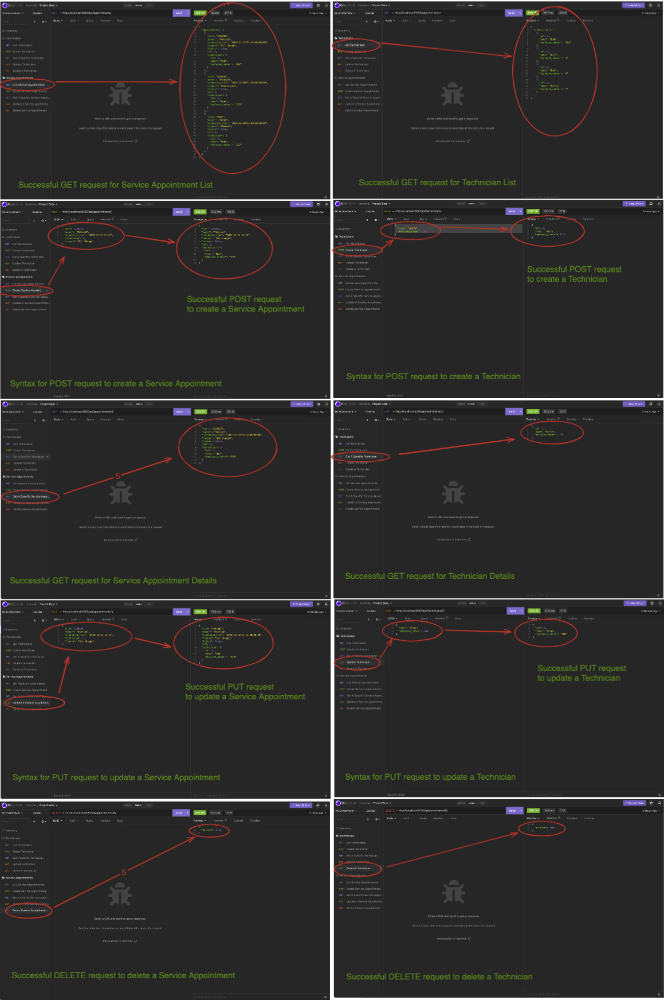

# CarCar

Team:

* Person 1 - Which microservice?
* Person 2 - Which microservice?
Patrick Mordaunt - Service

## Design

## Service microservice

## Models

* Technicians
The Technician model represents Technicians that will service the Automobiles.

Technician()
- Name
- Employee Number

* Service Appointments
The Appointments model represents service appointments that the customers can schedule for their Automobile.

Appointment()
- Vin
- Owner
- Scheduled Time
- Technician
- Reason
- Status

* AutomobileVO (Value Object to Inventory)
Required so that model changes can be made without having to access the Automobile Entity in Inventory. This allows us to parse the Automobile data for the Service Microservice.

AutomobileVO Properties
- Vin
- Import Href

## CRUD

|   Method      |             URL                                   |    What it does                                    |
| ------------- |:-------------------------------------------------:| :-------------------------------------------------:|
| GET           | http://localhost:8080/api/appointments/           | GET request List of Service Appointments           |
| GET           | http://localhost:8080/api/appointments/<int:pk>/  | GET request Service Appointment Details            |
| POST          | http://localhost:8080/api/appointments//          | POST request to Create New Service Appointment     |
| PUT           | http://localhost:8080/api/appointments/<int:pk>/  | PUT request to Update Existing Service Appointment |
| DELETE        | http://localhost:8080/api/appointments/<int:pk>/  | DELETE request to Delete Service Appointment       |

|   Method      |             URL                                 |    What it does                    |
| ------------- | :----------------------------------------------:| :----------------------------------------:|
| GET           | http://localhost:8080/api/technicians/          | GET request List of Technicians           |
| GET           | http://localhost:8080/api/technicians/<int:pk>/ | GET request Technician Details            |
| POST          | http://localhost:8080/api/technicians//         | POST request to Create New Technician     |
| PUT           | http://localhost:8080/api/technicians/<int:pk>/ | PUT request to Update Existing Technician |
| DELETE        | http://localhost:8080/api/technicians/<int:pk>/ | DELETE request to Delete Technician       |

## Insomnia Requests

## Sales microservice

Explain your models and integration with the inventory
microservice, here.
