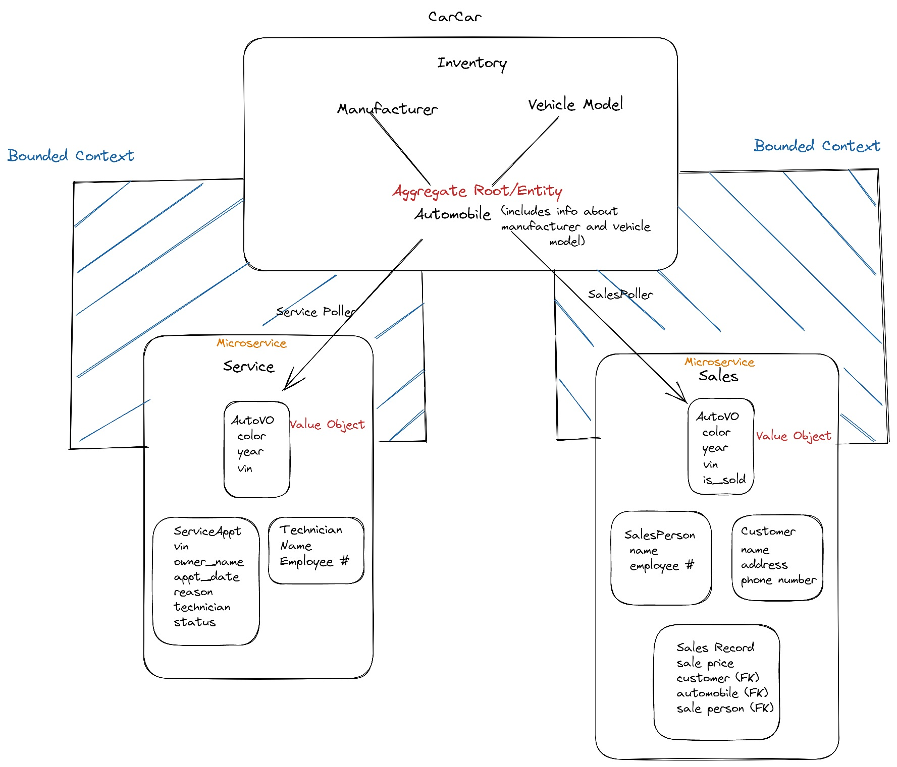
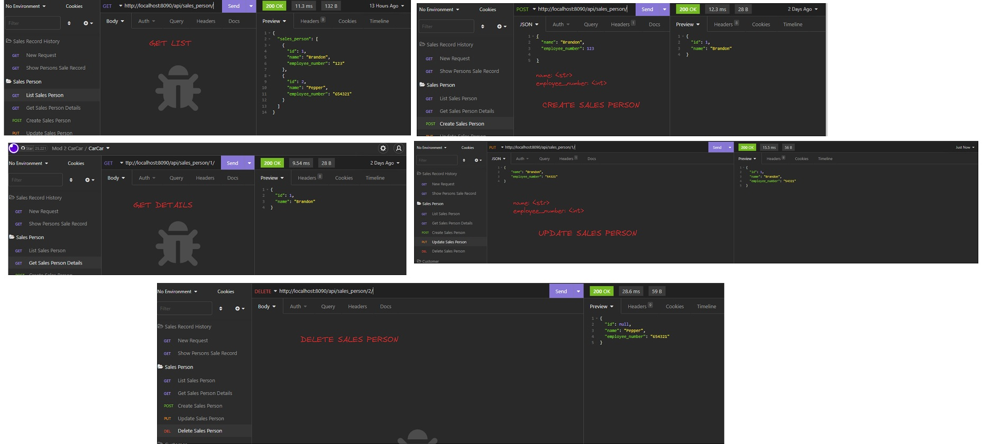
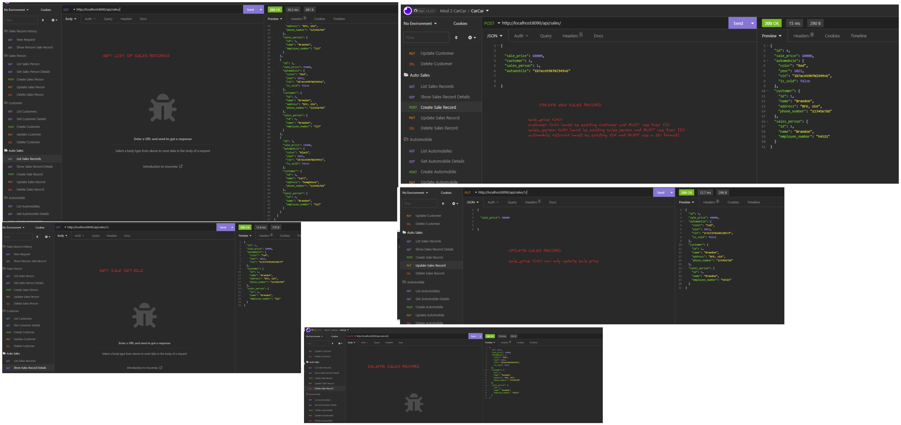

# CarCar

Team:

* Patrick - Service
* Brandon - Sales

## Design

## Getting Started

- Start by forking the project from the following: https://gitlab.com/b_matran/project-beta

- Copy the Clone with HTTPS link.

- Open up your command terminal and cd into your project directory. Ex: CD E:\Projects

In your command terminal type:

        git clone <paste Clone with HTTPS link>

- In your command terminal type (to create a database):

        docker volume create beta-data

- In your command terminal type (this is to create images):

        docker-compose build

- Then type (to create containers):

        docker-compose up

- All containers should be running and you should be able to see the app from http://localhost:3000

## Trouble Shooting Docker (Do this if you run into unresolvable issues)

In your command terminal type:

        docker container prune -f

        docker volume rm beta-data

        docker volume create beta-data

        docker-compose up

## Ports

Port 3000 - Connect to React APP

Port 15432 - Postgres DB

Port 8080 - Service API

Port 8090 - Sales API

Port 8100 - Inventory API

## Inventory API

 * Manufacturer API

|   Method      |       URL                                                                     |    What it does             |
| ------------- |:-----------------------------------------------------------------------------:| ---------------------------:|
| GET           | http://localhost:8100/api/manufacturers/                                      | GET List of Manufacturers   |
| GET           | http://localhost:8100/api/manufacturers/<int:pk>/                             | GET Manufacturer Details    |
| POST          | http://localhost:8100/api/manufacturers/                                      | POST Create Manufacturer    |
| PUT           | http://localhost:8100/api/manufacturers/<int:pk>/                             | PUT Update Manufacturer     |
| DELETE        | http://localhost:8100/api/manufacturers/<int:pk>/                             | DELETE Delete Manufacturer  |

 * Vehicle Model API

|   Method      |       URL                                                                     |    What it does              |
| ------------- |:-----------------------------------------------------------------------------:| ----------------------------:|
| GET           | http://localhost:8100/api/models/                                             | GET List of Vehicle Models   |
| GET           | http://localhost:8100/api/models/<int:pk>/                                    | GET Get Vehicle Model Details|
| POST          | http://localhost:8100/api/models/                                             | POST Create Vehicle Model    |
| PUT           | http://localhost:8100/api/models/<int:pk>/                                    | PUT Update Vehicle Model     |
| DELETE        | http://localhost:8100/api/models/<int:pk>/                                    | DELETE Delete Vehicle Model  |

 * Automobiles API

|   Method      |       URL                                                                     |    What it does           |
| ------------- |:-----------------------------------------------------------------------------:| --------------------------|
| GET           | http://localhost:8100/api/automobiles/                                        | GET List of Automobiles   |
| GET           | http://localhost:8100/api/automobiles/<str:vin>/                              | GET Get Automobile Details|
| POST          | http://localhost:8100/api/automobiles/                                        | POST Create Automobile    |
| PUT           | http://localhost:8100/api/automobiles/<str:vin>/                              | PUT Update Automobile     |
| DELETE        | http://localhost:8100/api/automobiles/<str:vin>/                              | DELETE Delete Automobile  |

## Service microservice

## Models

* Technicians
The Technician model represents Technicians that will service the Automobiles.

Technician()
- Name
- Employee Number

* Service Appointments
The Appointments model represents service appointments that the customers can schedule for their Automobile.

Appointment()
- Vin
- Owner
- Scheduled Time
- Technician
- Reason
- Status

* AutomobileVO (Value Object to Inventory)
Required so that model changes can be made without having to access the Automobile Entity in Inventory. This allows us to parse the Automobile data for the Service Microservice.

AutomobileVO Properties
- Vin
- Import Href

## CRUD

|   Method      |             URL                                   |    What it does                                    |
| ------------- |:-------------------------------------------------:| :-------------------------------------------------:|
| GET           | http://localhost:8080/api/appointments/           | GET request List of Service Appointments           |
| GET           | http://localhost:8080/api/appointments/<int:pk>/  | GET request Service Appointment Details            |
| POST          | http://localhost:8080/api/appointments//          | POST request to Create New Service Appointment     |
| PUT           | http://localhost:8080/api/appointments/<int:pk>/  | PUT request to Update Existing Service Appointment |
| DELETE        | http://localhost:8080/api/appointments/<int:pk>/  | DELETE request to Delete Service Appointment       |

|   Method      |             URL                                 |    What it does                    |
| ------------- | :----------------------------------------------:| :----------------------------------------:|
| GET           | http://localhost:8080/api/technicians/          | GET request List of Technicians           |
| GET           | http://localhost:8080/api/technicians/<int:pk>/ | GET request Technician Details            |
| POST          | http://localhost:8080/api/technicians//         | POST request to Create New Technician     |
| PUT           | http://localhost:8080/api/technicians/<int:pk>/ | PUT request to Update Existing Technician |
| DELETE        | http://localhost:8080/api/technicians/<int:pk>/ | DELETE request to Delete Technician       |

## Insomnia Requests

## Sales microservice

Models:

* AutoVO
Because we have made the Automobile model in Inventory as our aggregate root and we need some way to parse automobile data to our sales microservice. AutoVO is the necessary value object. It will be used to create instances of the cars in Automobile and be manipulated accordingly for the sales microservice.

* AutoVO Properties
    - color
    - year
    - vin
    - is_sold

* Sales Person
The sales person represents the employee who makes the sale and will be part of the Sales Record model.

* SalesPerson Properties

    - name
    - employee_number

* Customer
The customer represents the customer purchasing the vehicle. Their information will be reflected within the Sales Record Model along with Sales Person and AutoVO.

* Customer Properties

    - name
    - address
    - phone number

* Sales Record
The Sales Record will reflect one property (sale price) and will use the other models are Foreign Keys to access their data. In Insomnia, the Sales Record will reflect all information in the Sales Person, Customer and AutoVO.

* Sales Record Properties

    - sale_price
    - customer (Foreign Key)
    - automobile (Foreign Key)
    - sale_person (Foregin Key)

## Sales CRUD

 * Sales Person API

|   Method      |       URL                                                                     |    What it does           |
| ------------- |:-----------------------------------------------------------------------------:| --------------------------|
| GET           | http://localhost:8090/api/sales_person/                                       | GET List of Sales Persons |
| GET           | http://localhost:8090/api/sales_person/<int:pk>/                              | GET Sales Person Details  |
| POST          | http://localhost:8090/api/sales_person/                                       | POST Create Sales Person  |
| PUT           | http://localhost:8090/api/sales_person/<int:pk>/                              | PUT Update Sales Person   |
| DELETE        | http://localhost:8090/api/sales_person/<int:pk>/                              | DELETE Delete Sales Person|

 * Customer API

|   Method      |       URL                                                                     |    What it does           |
| ------------- |:-----------------------------------------------------------------------------:| --------------------------|
| GET           | http://localhost:8090/api/customers/                                          | GET List of Customers     |
| GET           | http://localhost:8090/api/customers/<int:pk>/                                 | GET Get Customer Details  |
| POST          | http://localhost:8090/api/customers/                                          | POST Create Customer      |
| PUT           | http://localhost:8090/api/customers/<int:pk>/                                 | PUT Update Customer       |
| DELETE        | http://localhost:8090/api/customers/<int:pk>/                                 | DELETE Delete Customer    |

 * Sales Record API

|   Method      |       URL                                                                     |    What it does           |
| ------------- |:-----------------------------------------------------------------------------:| --------------------------|
| GET           | http://localhost:8090/api/sales/                                              | GET List of Sales Records |
| GET           | http://localhost:8090/api/sales/<int:pk>/                                     | GET Get Sale Details      |
| POST          | http://localhost:8090/api/sales/                                              | POST Create Sale Record   |
| PUT           | http://localhost:8090/api/sales/<int:pk>/                                     | PUT Update Sale Record    |
| DELETE        | http://localhost:8090/api/sales/<int:pk>/                                     | DELETE Delete Sale Record |

## Sales Microservice Insomnia Requests

* Sales Person

* Customer

* Sales Record

